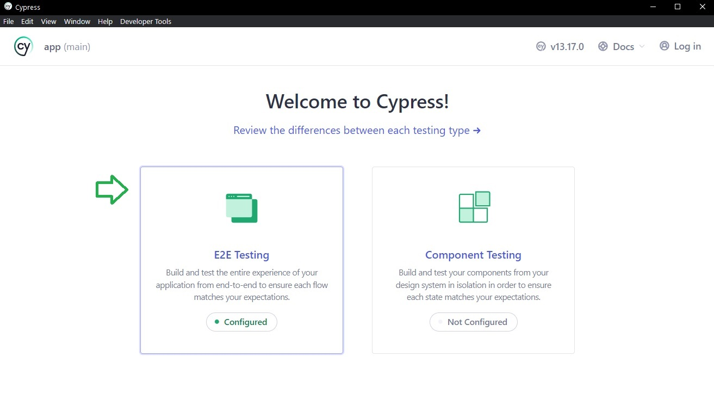
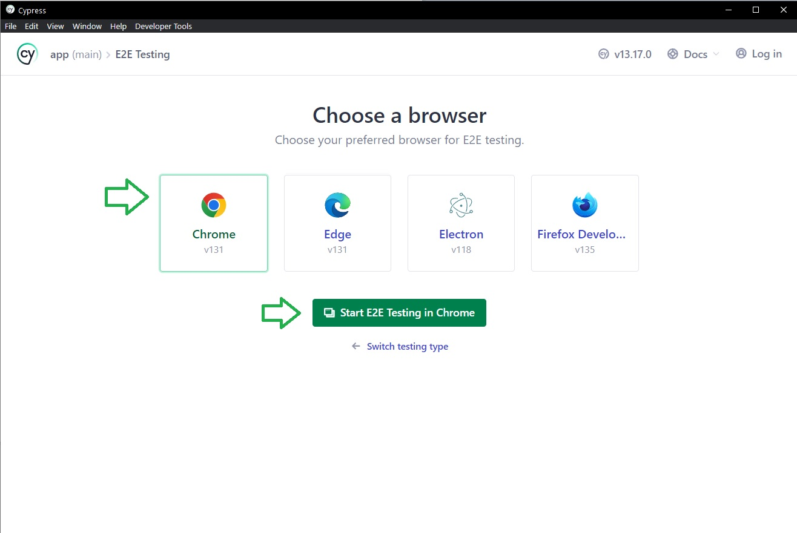
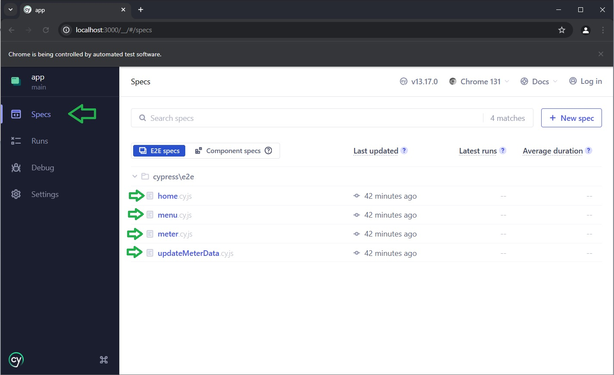
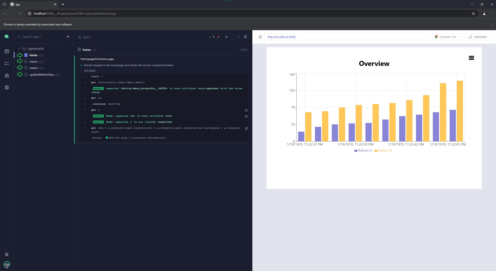

# Introduction

I have been invited to complete this coding assignment. They deliberately keept the assignment vague, leaving much room for me to make choices. I documented my design choices.

They provided me with a simple server application that exposed two endpoints. One to fetch meter interval data, and another to submit a new entry.

What was asked in the assignment:
* Visualises the meter interval data fetched from the server. We fully leave it up to you on how to design something for this.
* Has a way for a user to upload more meter interval data which is then also visualized.


# Behaviour/design choices I've made

For this assignment, I choose to simply show the data that I get from the API.

For that, I didn't add any verification for duplicated data (such as two intervals from a battery happening in the same date/time). This is as it is because that's technically not wrong from my point of view, since the battery has two interval entries.

As a next step related to duplicated data, I would check with the team/PO for a better view on this behavior and what are the requirements in this specific situation. Since I don't know all the details or the use cases, I would initially propose to add all the entries for the same date in the same bar of the chart, differentiating them by color, for example, in the case they have different consumption values. For the situation where both values (timestamp and kwh) are the same, I would consult if this is a bug in the API side or a feature that we want to support.
Overview of what was added

For showing the data, I have the overview page and the detail page. Overview shows both batteries in the same chart, while the detail page shows a dedicated chart to that specific battery.

For the starting point, I choose to add the following things:

- Overview page: a good start where you can view all the data together.
- Battery detail page: a detail page where all the operations related to the battery are bundled together.
- Interval form: a simple form located in the detail page where you can add a new consumption entry to your battery
- Basic e2e tests: the project is very simple and straight forward, so I decided for e2e instead of unit testing since it's easy to test the whole flow. My units are very small and mostly for the presentation of the data.
- Adjusted server post method: added an error boundary in the post method so I could handle it in the app when needed (in case I try to add data to a battery that doesn't exist).
- Good navigation through keyboard, so you don't need to use the mouse (accessibility, yay!).
- Simple layout that's responsive.

## Next steps

- Move MeterIntervalForm items to a separate component, to improve readability on the parent component.
- Setup MSW to test API response without hitting the API itself.
- Improve data fetch after insertion. Could fetch only new entries based on id/date depending on the structure of the data (avoid re-fetching all the data again after post request).

# Running the project

## Getting Started

### Running the server

```
cd server/
npm i
node app.js
```

It will expose a server app running on port: 3001.

### Running the front-end

Go to the front-end app code and install the dependencies.

```bash
cd app/
npm i
```

In the same folder, create a `.env` file. Copy the variables from `.example.env` and fill in the values. You can find the value for `NEXT_PUBLIC_API_URL` in the server file. It's the url that's exposed as the API url from where you'll be getting the data.

Still in the `/app` folder, run the dev server (remember to have the server running in another terminal tab before running the front-end. Otherwise you won't see any data =X).


```bash
npm run dev
```

Open [http://localhost:3000](http://localhost:3000) with your browser to see the result.

## Tests

Currently there's E2E tests with Cypress. It's recommended to run the built code for testing.

In a terminal tab, navigate to the app root folder and run the build script:

```bash
cd app/
npm run build && npm run start
```


Start the server in another terminal tab.

```bash
cd server/
node app.js
```


Then, in a third terminal tab, run the test script:

```bash
cd app/
npm run cypress:open
```

After that, cypress will open a window, where you can select the type of tests you're going to run. Select "End to End Testing".




Then, select the browser you're going to run the tests on and click on the button `Start E2E Tests in <browser-of-choice>`.




After that, a browser window will open, with a dashboard showing all the tests that are available to be checked. Click on `Specs` in the left menu and select the spec you want to run.




Then you'll be redirected to a page with a split view. On the left, you'll have available the test specs and the test output (if failed or passed, for example). On the right you'll see the application running while the test run.

To run another test, you just have to select another test spec on the list to your left.




## Packages
- [recharts](https://recharts.org/en-US/): lightweight chart package that's being used on the market. Has constant updates. Helps creating simple and customizable charts quickly with a focus on ease of use. Responsive.
- [react-hook-form](https://www.react-hook-form.com/): performant, flexible and extensible forms with easy-to-use validation.

## TODO
- Move MeterIntervalForm items to a separate component, to improve readability on the parent component;
- Setup MSW to test API response without hitting the API itself;
- Show a combined chart with the data from all batteries in the homepage;
- Improve data fetch after insertion. Could fetch only new entries based on id/date depending on the structure of the data (avoid refetching all the data again after post request);
- Use React Server Components (/app instead of /pages);

### Notes

Why E2E
- Validating critical workflows like adding new meter interval
- Ensuring data is persisted and displayed through multiple screens